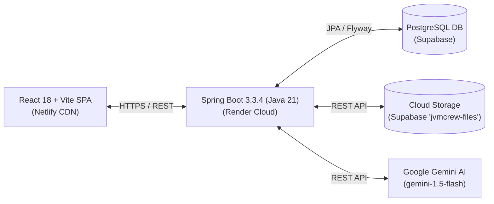

# EngineerSpace

> **The Engineering Team Operating System & AI Learning Platform for SDE Interns and Rotating Leads.**

[](https://engineerspace.netlify.app)
[](https://jvm-crew.onrender.com)
[](https://openjdk.org)
[](https://spring.io/projects/spring-boot)
[](https://react.dev)
[](https://vitejs.dev)
[](https://tailwindcss.com)
[](https://supabase.com)

---

## 1. Overview
EngineerSpace is a unified platform designed to streamline daily engineering operations, track curriculum mastery, manage homework assignments, facilitate daily standups with voice audio recordings, and sharpen technical skills with an AI-powered Interview Lab.

---

## 2. Core Capabilities

- **My Day**: Daily command center featuring streak tracking, active task strip, homework milestones, and lead briefs.
- **Tasks (Kanban)**: 4-stage Kanban workflow (`BACKLOG` -> `IN_PROGRESS` -> `IN_REVIEW` -> `DONE`) with drag-and-drop, role permissions, comments, and audit logs.
- **Homework Center**: Assignment publishing, solution reveal controls, code submissions, and grading rubrics (0–100).
- **Curriculum Roadmap**: Structured SDE topic tracking with real calculated mastery metrics.
- **Daily Standups & Voice Studio**: Check-ins with in-browser audio recording (Opus/WebM), Supabase Cloud Storage persistence, byte-range streaming playback, and PDF generation.
- **Interview Lab & AI Coach**: Technical mock interviews, concept practice questions with progressive hints, and an in-browser algorithmic coding arena powered by Google Gemini (with OpenAI fallback).
- **Team Cockpit & Digital Identity**: Team member roster, monthly leadership rotation management, 3D collectible character cards, and dossier links.
- **Notification Center**: In-app notifications and real-time Web Push notifications via VAPID and Service Worker (`sw.js`).

---

## 3. Architecture Overview



---

## 4. Documentation Index

Comprehensive engineering and governance documentation is maintained in the `docs/` directory:

| Document | Description |
| :--- | :--- |
| [`docs/PRD.md`](docs/PRD.md) | Product Requirement Document — Modules, roles, user stories, and specs. |
| [`docs/ARCHITECTURE.md`](docs/ARCHITECTURE.md) | Technical Architecture — Complete system design, data flows, and layer breakdown. |
| [`docs/DESIGN.md`](docs/DESIGN.md) | Global Design System — Layout containers, color tokens, typography, and UI standards. |
| [`docs/RULES.md`](docs/RULES.md) | 30 Permanent Engineering Rules — Coding, security, and architectural invariants. |
| [`docs/TEST_PLAN.md`](docs/TEST_PLAN.md) | Master Test Plan — Test matrices, security checks, and execution commands. |
| [`docs/SECURITY.md`](docs/SECURITY.md) | Security Policy & Threat Model — Auth, IDOR defense, rate limits, and runbooks. |
| [`docs/DECISIONS.md`](docs/DECISIONS.md) | Architecture Decision Records (ADR-001 through ADR-010). |
| [`docs/MEMORY.md`](docs/MEMORY.md) | Living Project Memory — Verified features, known gotchas, and component maps. |
| [`TASKS.md`](TASKS.md) | Master Task Tracker — Phased engineering roadmap. |

---

## 5. Quick Start & Local Development

### Option A: Running with Docker Compose (Recommended)
```bash
# Clone the repository
git clone https://github.com/Arshad-28/JVM---CREW.git
cd JVM---CREW

# Copy environment variables
cp .env.example .env

# Start all services (PostgreSQL, Backend API, Frontend SPA)
docker compose up --build
```
- Frontend: `http://localhost:3000`
- Backend API: `http://localhost:8080`
- PostgreSQL: `localhost:5432`

---

### Option B: Running Services Manually

#### Prerequisites
- Java 21 LTS
- Node.js 18+ & npm
- PostgreSQL 15+

#### 1. Backend Setup
```bash
cd server

# Set environment variables or configure application-dev.yml
cp .env.example .env

# Build and run with Maven wrapper
./mvnw spring-boot:run
```
The backend will start at `http://localhost:8080`.

#### 2. Frontend Setup
```bash
cd client

# Install dependencies
npm install

# Start Vite development server
npm run dev
```
The frontend will start at `http://localhost:5173` and automatically proxy `/api` calls to `http://localhost:8080`.

---

## 6. Testing

### Run Backend Tests
```bash
cd server
./mvnw clean test
```

### Build & Validate Frontend
```bash
cd client
npm run build
```

---

## 7. License
This project is licensed under the terms specified in the [LICENSE](LICENSE) file.\n