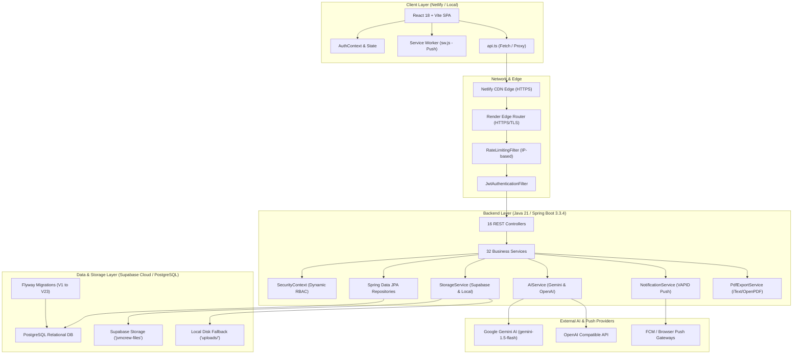

# EngineerSpace — Technical Architecture Document

## 1. Executive Summary
EngineerSpace is a full-stack, cloud-native Engineering Team Operating System & AI Learning Platform. It is engineered with a decoupled multi-tier architecture comprising a single-page React frontend, a high-throughput Spring Boot backend REST API, PostgreSQL database with Flyway schema versioning, Supabase Cloud Storage with local fallback, and dual AI engine integrations.

---

## 2. System Architecture Diagram



---

## 3. Frontend Architecture

### 3.1 Stack & Tooling
- **Core Framework**: React 18.2.0 with TypeScript / JSX.
- **Build Tooling**: Vite 5.x with fast HMR and optimized production bundling.
- **Styling Engine**: Tailwind CSS 3.4 with custom utility classes, CSS variables for theme tokens, and animations.
- **Icons**: Lucide React icon library.
- **Animation Engine**: Framer Motion for page transitions, interactive cards, and modal animations.
- **HTTP Client**: Native Fetch API wrapped inside unified typed helper `client/src/services/api.ts`.
- **Proxy Configuration**: `client/vite.config.ts` proxies `/api` requests to `http://localhost:8080` in local development mode.

### 3.2 Context & State Management
- **`AuthContext.tsx`**: Manages user authentication state, current user profile, active JWT token persistence (`localStorage`), team membership context, and login/logout lifecycle.
- **`NotificationContext.tsx`**: Subscribes to in-app real-time notifications, manages read/unread state counts, and handles Service Worker Web Push registration via VAPID.
- **`ThemeContext.tsx`**: Manages theme styling (Dark mode standard, accent highlights).

### 3.3 Routing & Navigation (`App.tsx`)
- Protected route wrapper (`ProtectedRoute.tsx`) enforcing authentication and role requirements (`MEMBER`, `LEAD`, `ADMIN`).
- Core views:
  - `/login`, `/register`, `/forgot-password` (Authentication)
  - `/my-day` (Member Dashboard & Lead Daily Brief)
  - `/tasks` (Kanban Task Board)
  - `/homework` (Assignment Submissions & Reviews)
  - `/curriculum` (SDE Learning Roadmap)
  - `/standup` (Daily Audio/Text Standup Studio)
  - `/interview-lab` (Mock AI Technical Interviews, Practice & Coding Arena)
  - `/team` (Team Cockpit, Member Cards & Roster)
  - `/profile` (User Settings & Digital Dossier)
  - `/notifications` (Notification Inbox)

---

## 4. Backend Architecture

### 4.1 Stack & Framework
- **Runtime**: Java 21 LTS (OpenJDK 21).
- **Framework**: Spring Boot 3.3.4.
- **Security**: Spring Security 6 with stateless JWT authentication filter.
- **Persistence**: Spring Data JPA with Hibernate 6.
- **Database Migrations**: Flyway Core (23 migrations: `V1__init.sql` to `V23__create_coding_challenges.sql`).
- **JSON Serialization**: Jackson 2 with JavaTimeModule for ISO 8601 timestamps.
- **Validation**: Jakarta Bean Validation (`@Valid`, `@NotNull`, `@NotBlank`, `@Size`).

### 4.2 Security & Authentication Lifecycle
1. **Request Interception**: Incoming requests pass through `RateLimitingFilter` to prevent brute force and DDoS abuse.
2. **JWT Authentication**: `JwtAuthenticationFilter` intercepts `Authorization: Bearer <token>` headers.
3. **Token Validation**: `JwtTokenProvider` validates the HMAC-SHA256 signature and checks expiration.
4. **Dynamic Role Resolution**: `CustomUserDetailsService` loads the user principal and dynamically evaluates `LeadershipAssignmentRepository` for the current calendar date to determine if the user holds active `Role.LEAD` status for their team.
5. **Security Context**: Sets authenticated `UserPrincipal` into Spring's `SecurityContextHolder`.

### 4.3 Controller & Service Structure (16 Controllers, 32 Services)
- **Authentication**: `AuthController` (`AuthService`, `JwtTokenProvider`, `CustomUserDetailsService`).
- **User Management**: `UserController` (`UserService`, `ProfileService`, `AvatarService`).
- **Team Management**: `TeamController`, `LeadershipController` (`TeamService`, `LeadershipService`).
- **Tasks**: `TaskController` (`TaskService`, `TaskAuditService`).
- **Homework**: `HomeworkController`, `HomeworkSubmissionController` (`HomeworkService`, `HomeworkSubmissionService`).
- **Curriculum**: `CurriculumController` (`CurriculumService`, `TopicProgressService`).
- **Standups & Audio**: `StandupController` (`StandupService`, `StorageService`, `SupabaseStorageService`, `LocalStorageService`, `PdfExportService`).
- **Interview Lab**: `InterviewLabController`, `CodingChallengeController` (`InterviewLabService`, `CodingChallengeService`, `AIService`, `GeminiClient`, `OpenAIClient`).
- **Notifications**: `NotificationController`, `PushSubscriptionController` (`NotificationService`, `WebPushService`).
- **Reports**: `ReportController` (`ReportService`, `PdfExportService`).

---

## 5. Storage Layer Architecture

### 5.1 Dual-Strategy Storage Design
The application uses a pluggable `StorageService` interface with primary Supabase Cloud Storage and local disk fallback.

```
StorageService (Interface)
├── SupabaseStorageService (Primary Production)
│   ├── Target Bucket: 'jvmcrew-files'
│   ├── Standard Path: standups/{teamId}/{year}/{month}/{week}/{fileName}
│   ├── Direct Streaming & Range-Request Support
│   └── Public / Presigned URL Resolution
└── LocalStorageService (Local Development Fallback)
    ├── Target Directory: ./uploads/
    └── Path Traversal Sanitation: normalize() + startsWith()
```

### 5.2 Standup Audio Persistence Pipeline
1. In-browser MediaRecorder records voice audio in `audio/webm;codecs=opus` or `audio/wav`.
2. Audio payload is sent as `multipart/form-data` with explicit MIME type and size headers to `POST /api/standups/voice`.
3. Backend validates MIME type against allowed list (`audio/webm`, `audio/wav`, `audio/mp4`, `audio/ogg`, `audio/mpeg`).
4. Backend uploads the binary stream to Supabase Storage bucket `jvmcrew-files`.
5. Database record is saved in `public.standups` with real metadata: `audio_file_name`, `audio_storage_path`, `audio_content_type`, `audio_file_size`.
6. Streaming endpoint `GET /api/standups/audio/{id}` proxies or redirects to the stored asset with HTTP `Accept-Ranges: bytes` support.

---

## 6. Database Schema & Flyway Migrations

The database schema is fully managed via 23 sequential Flyway migrations:

| Migration | Scope & Description |
| :--- | :--- |
| `V1__init.sql` | Initial schema: `users`, `teams`, `roles`, `refresh_tokens` |
| `V2__tasks.sql` | Task management: `tasks`, `task_comments`, `task_history` |
| `V3__homework.sql` | Homework assignments and submissions: `homework`, `homework_submissions` |
| `V4__curriculum.sql` | SDE curriculum: `subjects`, `topics`, `topic_progress` |
| `V5__standups.sql` | Daily standups: `standups`, `standup_blockers`, `standup_questions` |
| `V6__audio_metadata.sql` | Voice standup audio columns: `audio_file_name`, `audio_storage_path`, `audio_file_size`, `audio_content_type` |
| `V7__interview_lab.sql` | Interview lab sessions, questions, practice attempts, recommendations |
| `V8__notifications.sql` | In-app notifications and web push subscriptions |
| `V9__leadership_rotation.sql` | Monthly leadership assignments: `leadership_assignments` |
| `V10__user_profiles.sql` | User profiles, social links (GitHub, LinkedIn), college, bio |
| `V11__avatars.sql` | User avatar metadata and custom avatar selection |
| `V12__streaks.sql` | Daily streak tracking and activity audit logs |
| `V13__reports.sql` | Monthly lecturer reports and aggregate summaries |
| `V14__task_milestones.sql` | Task milestone and priority level enhancements |
| `V15__homework_solutions.sql` | Solution reveal controls and published answer keys |
| `V16__standup_confidence.sql` | Standup confidence rating (1–5) and sentiment tracking |
| `V17__interview_feedback.sql` | AI-generated score breakdowns and feedback rubrics |
| `V18__push_preferences.sql` | Granular user push notification preference flags |
| `V19__audit_log.sql` | Security and administrative audit trail logging |
| `V20__rate_limiting.sql` | Rate limiting bucket configuration and IP tracking |
| `V21__team_codes.sql` | Unique team join codes and registration keys |
| `V22__curriculum_ordering.sql` | Explicit sequence indices for curriculum subjects and topics |
| `V23__create_coding_challenges.sql` | In-browser coding challenges, test cases, and attempt history |

---

## 7. Multi-Tenant Team Isolation

EngineerSpace implements strict multi-tenancy at the data layer:
- Every data table containing team-scoped data (`tasks`, `homework`, `standups`, `curriculum`, `topic_progress`, `notifications`) contains a `team_id` foreign key.
- Spring Data JPA repository methods are scoped with `WHERE team_id = :teamId`.
- Controllers extract `currentUser.getTeamId()` from the authenticated `UserPrincipal` and pass it to service methods.
- Cross-tenant access attempts return HTTP 403 Forbidden or HTTP 404 Not Found.
- Administrators have global read permissions where explicitly granted.

---

## 8. External Integrations

### 8.1 Dual AI Engine (`AIService`)
- **Primary Provider**: Google Gemini (`gemini-1.5-flash` / Google Generative AI REST API) for fast, structured JSON interview questions, coding feedback, and scoring.
- **Fallback Provider**: OpenAI-compatible REST API client used if Gemini returns rate limits or service unavailability.
- **Resilience**: Timeout protection (15s max) and graceful degradation returning pre-compiled fallback questions if both AI providers fail.

### 8.2 Web Push Notifications (`WebPushService`)
- Implements RFC 8291 / RFC 8292 VAPID web push protocol.
- Client registers service worker (`sw.js`) and subscribes via `PushManager.subscribe()`.
- Public VAPID key is served via `GET /api/push/public-key`.
- Subscriptions are persisted in `push_subscriptions` table with endpoint, P256DH key, and auth secret.

### 8.3 PDF Export Service (`PdfExportService`)
- Generates downloadable PDF reports for individual daily standups, team daily summaries, and monthly lecturer compliance dossiers.
- Uses standard OpenPDF / iText layout engine with consistent typography, header branding, and table formatting.\n