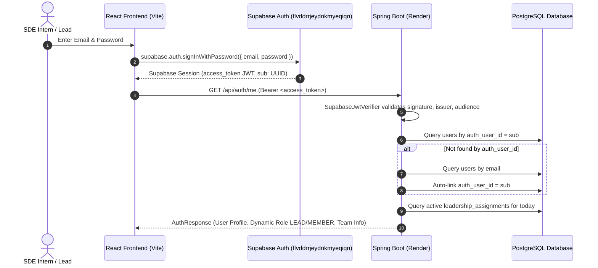

# EngineerSpace Authentication Architecture & Supabase Auth Migration

## 1. Overview
EngineerSpace has migrated its authentication engine from custom BCrypt password storage and HMAC-signed application tokens to **Supabase Auth**. This provides enterprise-grade authentication, session handling, token refresh, and identity management while preserving:
- All real PostgreSQL data and relations across 18 dependent tables.
- Primary key structure (`users.id` as `BIGSERIAL` / `Long`).
- Database-driven dynamic role resolution (`LEAD` vs `MEMBER` via `leadership_assignments`).
- Strict multi-tenant team isolation enforced server-side.

---

## 2. Architecture & Data Model

### 2.1 The `users` Table & Identity Binding
All application data (tasks, homework, standups, curriculum, meetings, metrics) references `users.id` (`BIGINT`). To maintain complete relational integrity, `users.id` was **not** changed to a UUID.

Instead, Flyway migration `V25__add_auth_user_id_to_users.sql` added:
```sql
ALTER TABLE users ADD COLUMN IF NOT EXISTS auth_user_id UUID UNIQUE;
ALTER TABLE users ALTER COLUMN password_hash DROP NOT NULL;
CREATE INDEX IF NOT EXISTS idx_users_auth_user_id ON users(auth_user_id);
```

### 2.2 Identity Resolution Flow


---

## 3. JWT Verification: `SupabaseJwtVerifier`

Spring Boot intercepts every incoming request via `JwtAuthenticationFilter`:
1. **Supabase Token Verification**:
   - The token is parsed using `io.jsonwebtoken` (JJWT).
   - Validates HMAC-SHA256 signature using `app.supabase.jwt-secret` (or Supabase Project Secret).
   - Validates claims:
     - `iss`: Matches `app.supabase.jwt-issuer` (`https://flvddrrjeydnkmyeqiqn.supabase.co/auth/v1`).
     - `aud`: Matches `authenticated`.
     - `sub`: Valid UUID corresponding to `auth.users.id`.
     - `exp`: Not expired.
2. **UserPrincipal Resolution**:
   - Queries `userRepository.findByAuthUserId(authUserId)`.
   - If not yet mapped, queries `userRepository.findByEmail(email)` and auto-links `existing.setAuthUserId(authUserId)`.
   - Resolves active `TeamMember` and computes `Role.LEAD` vs `Role.MEMBER` dynamically from `leadership_assignments`.
3. **Migration Fallback**:
   - If token is not a Supabase JWT, `tokenProvider.validateToken(jwt)` acts as secondary fallback during transitional rollouts.

---

## 4. Existing User Migration & Auto-Provisioning

To ensure zero friction for existing users in PostgreSQL:
1. **Direct Sign-In via Supabase**:
   If an existing user signs in via Supabase Auth with matching email, `JwtAuthenticationFilter` automatically associates their `auth_user_id` upon their first request to `/api/auth/me`.
2. **Seamless Fallback**:
   If an existing user whose password was not yet synced to Supabase Auth signs in, `AuthContext` falls back to `/api/auth/login`. The backend validates their BCrypt hash and uses `SupabaseAdminService` to provision their Supabase Auth user record, allowing future logins directly through Supabase Auth.

---

## 5. Team Member Provisioning: `SupabaseAdminService`

When a Team Lead registers a new intern in `TeamManagementSection`:
1. Frontend submits the member details with an explicit initial password (minimum 6 characters).
2. `TeamManagementService.addTeamMember`:
   - Checks if user exists.
   - Calls `SupabaseAdminService.createAuthUser(email, password, name)` using the Supabase Service Role Key (`POST /auth/v1/admin/users`) with `email_confirm: true`.
   - Saves the new `User` in PostgreSQL with `auth_user_id` set to the returned UUID.
   - Creates the `TeamMember` record and assigns a sequential Crew ID (e.g., `TECH-002`).

---

## 6. Frontend Configuration

The frontend uses the official `@supabase/supabase-js` client initialized in `client/src/services/supabase.ts`:
```typescript
import { createClient } from '@supabase/supabase-js';

const supabaseUrl = import.meta.env.VITE_SUPABASE_URL || 'https://flvddrrjeydnkmyeqiqn.supabase.co';
const supabaseAnonKey = import.meta.env.VITE_SUPABASE_ANON_KEY || '...';

export const supabase = createClient(supabaseUrl, supabaseAnonKey, {
  auth: {
    persistSession: true,
    autoRefreshToken: true,
    detectSessionInUrl: true,
    storageKey: 'jvmcrew_sb_token',
  },
});
```

### Session Lifecycle in `AuthContext.tsx`:
- Listens to `supabase.auth.onAuthStateChange` to sync refreshed tokens to `jvmcrew_token`.
- `login()` performs Supabase sign-in, caches token, and loads user profile.
- `register()` signs up user in Supabase Auth, retrieves UUID, and creates the Team & Lead in Spring Boot.
- `logout()` calls `supabase.auth.signOut()` and purges all workspace session caches.

---

## 7. Required Environment Variables

### Frontend (`client/.env` / Netlify)
| Variable | Description |
|---|---|
| `VITE_SUPABASE_URL` | Supabase project URL (e.g. `https://flvddrrjeydnkmyeqiqn.supabase.co`) |
| `VITE_SUPABASE_ANON_KEY` | Public Anon key for Supabase Auth |
| `VITE_API_BASE_URL` | Backend API URL (e.g. `https://jvm-crew.onrender.com/api`) |

### Backend (`server/src/main/resources/application.yml` / Render)
| Variable | Description |
|---|---|
| `SUPABASE_URL` | Supabase project URL |
| `SUPABASE_JWT_SECRET` | Supabase JWT secret from Project Settings -> API |
| `SUPABASE_SERVICE_ROLE_KEY` | Supabase Service Role Secret (Admin API) |
| `SUPABASE_JWT_ISSUER` | Default: `https://flvddrrjeydnkmyeqiqn.supabase.co/auth/v1` |
